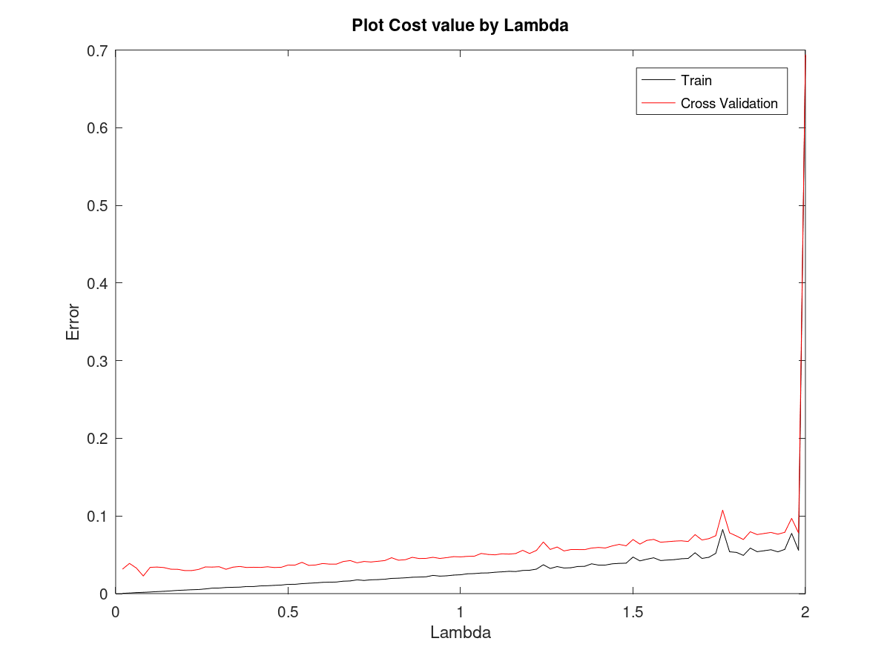

# Neural Network
## Some generals
As I mentioned before my nn architecture which has __one input layer with 9 unit__, __a couple of hidden layers with 36 unit__ and __one output layer__ that represent __probability of me wining__.
### Layers
#### 1. Input layer
> This layer has 9 units which each unit represent one position of Tic Tac Toe map. from position 1 to position 9.
#### 2. Output layer
> This layer has 1 unit that generate probability of me winning.

My system tries to get all possible next moves and try to evaluate the probability for each move and choose maximum probability corresponding next move.


### Function prototypes and some documentation
* ##### fmincg
  * ```matlab
    function [X, fX, i] = fmincg(f, X, options, P1, P2, P3, P4, P5)
    % This function is created by "Carl Edward Rasmussen".
    % Giving costFunction and nn parameters 
    % to achieve the optimum of costFunction. 
    ``` 
    [Carl Edward Rasmussen](http://mlg.eng.cam.ac.uk/carl/)
* ##### learningCurve
  * ```matlab
    function [error_train, error_cross] = ...
    learningCurve(X, y, X_cross, y_cross, lambda)
    % By this function you can plot your costFunction 
    % by changing number of training examples to achieve what is your
    % your model problem, high bias? high variance? Try it.
    ```
* ##### main
  * This is not a function, it just represents how to use these functions to train you nn.
* ##### nnCostFunction
  * ```matlab
    function [J grad] = nnCostFunction(nn_params, ...
                   input_layer_size, ...
                   first_hidden_layer_size, ...
                   second_hidden_layer_size, ...
                   num_labels, ...
                   X, y, lambda)
    % Giving weights matrix that unrolled into nn_params vector, layers size
    % X, y and reguralization parameter to get the value and gradient 
    % of costFunction.
    ```
* ##### plotCostByLambda
  * ```matlab
    function [J_training J_cross lambda nn_params] = ...
    plotCostByLambda(X_training, y_training, X_cross, y_cross)
    % By this function you can plot your costFunction 
    % by changing reguralization parameter to achieve best lambda
    % or reguralization parameter (optimum of costFunction)
    ``` 
    
* ##### predict
  * ```matlab
    function p = predict(Theta1, Theta2, Theta3, X)
    % This function returns probability of me winning by 2 argument of
    % weights and inputs
    ```
* ##### randInitializeWeights
  * ```matlab
    function W = randInitializeWeights(L_in, L_out)
    % By the name of this func you can guess specification of this.
    % Giving number of input and output layer to generate one part of
    % your weight matrix between 2 layer.
    ``` 
     <br/>
    Where rho is random initialized weights.
* ##### sigmoid
  * ```matlab
    function g = sigmoid(z)
    % This is my activation function (SIGMOID)
    ```
    
    
* ##### sigmoidGradient
  * ```matlab
    function g = sigmoidGradient(z)
    % This is gradient of my sigmoid function 
    ``` 
    
* ##### trainNN
  * ```matlab
    function [Theta1, Theta2, Theta3] = ...
             trainNN(input_layer_size, ...
                     first_hidden_layer_size, ...
                     second_hidden_layer_size, ...
                     num_labels, ..., 
                     X, y, lambda)
    % This function minimize your costFunction by gradient decsent algorithm
    % or fmincg which work with more efficiency
    ``` 