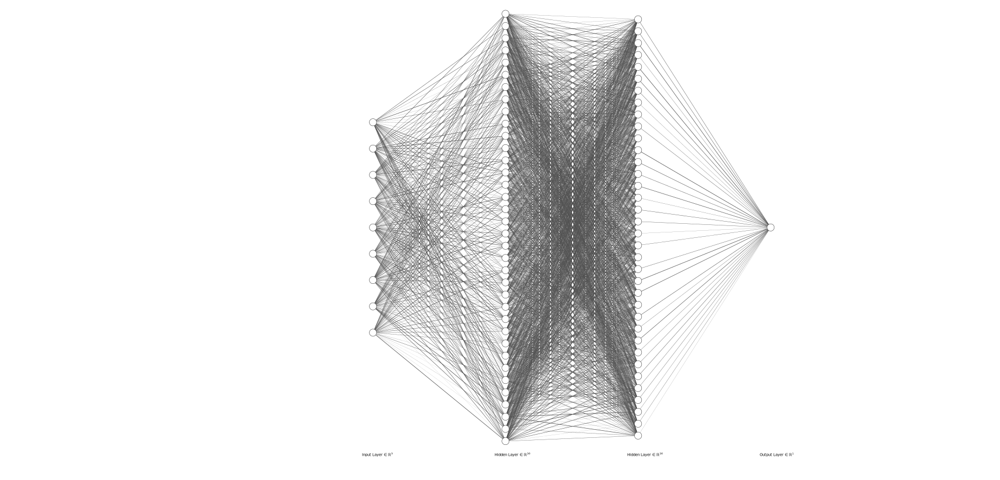
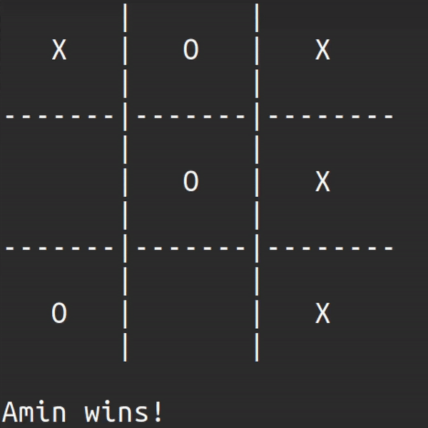
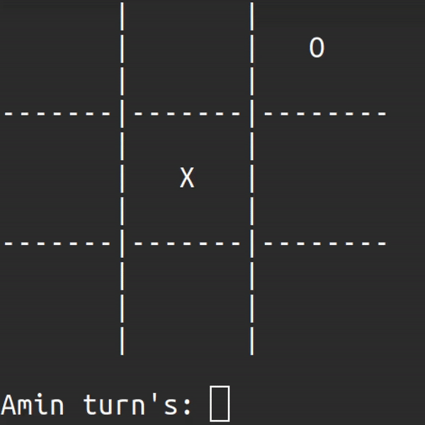

# Tic-Tac-Toe
### Requirements
1. __Octave__ programming language
   1. Linux operating system. 
   2. If you want play with AI, you should install octave on your system. for check:
   `octave --version`
### Description
This is implementation of [Tic Tac Toe](https://en.wikipedia.org/wiki/Tic-tac-toe).
> #### Assets
> Include some photos about NN architecture, ....   
> _______
> #### Data
> Data directory include some headers and cpp files.  
> __Training Data__ is for train data to feed NN but how? by playing random versus random.  
> __OperatingSystem__ is for execute bash commands.
> _______
> #### Model
> Model directory include __Board__, __Player__ and __Game__ classes.  
> __Board__ is for create board instance. by the name you can guess what each class do.  
> __Player__ is for create player instance. each player has __id__, __name__, __isAI__ and __notation__.  
> __Game__ is main part of Tic Tac Toe logic. each game has __set__ (calculate by number of turns), a pair of __players__ and __board__.
> _______
> #### Neural Network
> This is main part of __AI__ core. by this directory, your computer can think and after that turn a move. 
> Neural Network directory has several octave function files and one octave script which recall functions to predict next move.
> 

### Some examples of playing
#### Human wins

___
#### AI wins

___
#### Same
