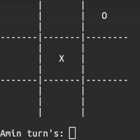

# Tic-Tac-Toe
### Requirements
1. __Linux__ operating system
2. __Octave__ programming language <br/>
   If you want to play with AI, you should install octave on your system. for check:
   `octave --version`
### Description
This is the implementation of [Tic Tac Toe](https://en.wikipedia.org/wiki/Tic-tac-toe).
> #### Assets
> Include some photos about NN architecture, .... <br/> 
> _______
> #### Data
> The data directory includes some headers and CPP files. <br/>
> __Training Data__ is for train data to feed NN but how? by playing random versus random. <br/>
> __OperatingSystem__ is for executing bash commands.
> _______
> #### Model
> The model directory includes __Board__, __Player__ and __Game__ classes. <br/>
> __Board__ is for creating board instance. by the name you can guess what each class does. <br/>
> __Player__ is for creating a player instance. each player has __id__, __name__, __isAI__ and __notation__. <br/>
> __Game__ is the main part of Tic Tac Toe logic. each game has a __set__ (calculate by the number of turns), a pair of __players__ and a __board__.
> _______
> #### Neural Network
> This is the main part of __AI__ core. by this directory, your computer can think and after that turn a move. 
> Neural Network directory has several octave function files and an octave script which recall functions to predict the next move. <br/>
> The below picture presents my nn architecture which has __one input layer with 9 units__, __a couple of hidden layers with 36 units__ and __one output layer__ that generates __ the probability of me winning__.
> 

[See more about my architecture](https://github.com/mr-seifi/Tic-Tac-Toe/tree/main/NeuralNetwork)
### Some examples of nn data
```matlab
 1 0 -1 -1 1 1 0 -1 1
 -1 0 1 0 -1 1 1 -1 -1
 -1 -1 -1 1 -1 1 0 1 0
 -1 -1 -1 1 0 1 -1 1 0
 -1 1 -1 1 -1 0 -1 1 1
 -1 -1 -1 0 1 1 0 0 1
 0 0 -1 -1 1 -1 1 1 -1
 % 1 represents it's my turn
 % 0 represents empty position
 % -1 represents it's your enemy turn
 % last column represents for 1 (i win), 0 (equal) and -1 (enemy wins)
```
### Some examples of playing
#### Human wins

___
#### AI wins

___
#### Same


Note: Neural network can't solve this problem as well as MiniMax solution.